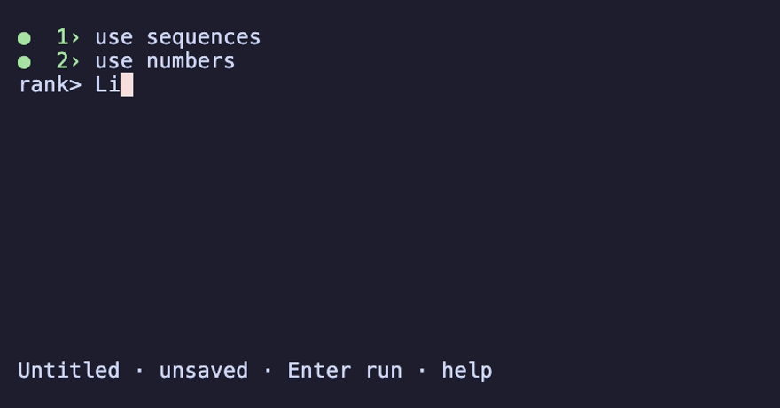

# Rank

[](https://github.com/kmmbvnr/rank/actions/workflows/ci.yml)
[](https://www.npmjs.com/package/@arrrank/cli)
[](LICENSE)


Rank is a modern BASIC for small screens and big algorithms.

- Data-first pipelines: values flow through functions from left to right.
- Multidimensional arrays, broadcasting, and operations by rank or axis.
- Lazy sequences, ranges, and generators.
- Functions, closures, and memoization.
- A notebook-style CLI: edit cells, rerun code, and see results alongside it.

[Project Euler #2](demos/euler/002_evenfib.ra): sum the even Fibonacci numbers.
Start with 100, edit the limit to 4 million, press Ctrl-R. Answer: **4613732**.



## Run

Requires Node.js 22.12 or newer, Python, and a C++20 build toolchain.

Open the REPL without a global install:

```console
npx @arrrank/cli
```

npx downloads the package to its cache on the first run.
For a permanent `rank` command:

```console
npm install -g @arrrank/cli
rank
```

Or run from source:

```console
npm install
npm run build
npm run rank
```

```text
rank> use numbers
rank> 2 + 3 * 4
14
rank> 1 to 5 sum
15
```

Run a file, optionally passing inputs:

```console
npx @arrrank/cli demos/euler/001_multiples.ra --limit 10
```

## Tests

```console
npm test
npm run rank -- test demos/euler
```

## Documentation

- [Language specification](docs/CURRENT_SPEC.md) and [standard library](docs/stdlib/reference.md)
- [CLI and editor](packages/cli/README.md)
- [Example programs](demos)
- [Contribution guidelines](CONTRIBUTING.md)
