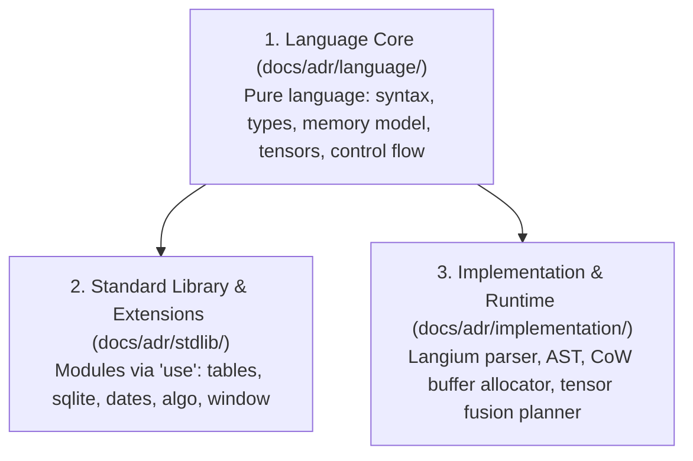

# Rank Architecture Decision Records (ADR)

This directory documents the foundational architectural decisions made since the inception of the Rank language, capturing the design rationale, trade-offs, and technical evolution.

---

## Decision Domains

The architecture of Rank is organized across three primary domains:

### 1. [Language Core (`language/`)](language/README.md)
Contains the decisions governing the language core that require **no external imports** (`use`). The core is structured into **Four Acts**:
- **[Act I: Philosophy, Ergonomics & Program Structure](language/README.md#act-i-philosophy-ergonomics--program-structure)** (ADR-0000 – ADR-0003)
- **[Act II: Value Model & Type System](language/README.md#act-ii-value-model--type-system)** (ADR-0100 – ADR-0107)
- **[Act III: Arrays, Tensors & Unified Selection Engine](language/README.md#act-iii-arrays-tensors--unified-selection-engine)** (ADR-0200 – ADR-0207)
- **[Act IV: Computation, Control Flow & Dataflow](language/README.md#act-iv-computation-control-flow--dataflow)** (ADR-0300 – ADR-0308)

### 2. [Standard Library & Extensions (`stdlib/`)](stdlib/README.md)
Contains the decisions governing domain vocabularies, query blocks, and standard library modules loaded via `use`:
- **[Block 00xx: Environment Integration & Testing](stdlib/README.md#block-00xx-environment-integration--testing)** (ADR-0000 – ADR-0001)
- **[Block 01xx: Tabular Data, Query Pipeline & SQLite](stdlib/README.md#block-01xx-tabular-data-query-pipeline--sqlite)** (ADR-0100 – ADR-0102)
- **[Block 02xx: Algorithmic Structures & Graphs](stdlib/README.md#block-02xx-algorithmic-structures--graphs)** (ADR-0200 – ADR-0201)
- **[Block 03xx: Sequences, Windows, Dates & Numerics](stdlib/README.md#block-03xx-sequences-windows-dates--numerics)** (ADR-0300 – ADR-0303)

### 3. [Implementation & Runtime (`implementation/`)](implementation/README.md)
Decisions governing compiler internals, parser architecture, and execution engines:
- **[ADR-0000](implementation/0000-langium-parser-architecture-and-grammar-decoupling.md)**: Langium Parser Architecture and Grammar Decoupling
- **[ADR-0001](implementation/0001-transparent-cow-memory-model-and-buffer-recycling.md)**: Transparent Copy-on-Write Memory Model and Buffer Recycling
- **[ADR-0002](implementation/0002-abstract-interpretation-and-symbolic-shape-inference.md)**: Abstract Interpretation and Symbolic Shape Inference
- **[ADR-0003](implementation/0003-tensor-kernel-fusion-and-execution-planner.md)**: Tensor Kernel Fusion and JIT Execution Planner
