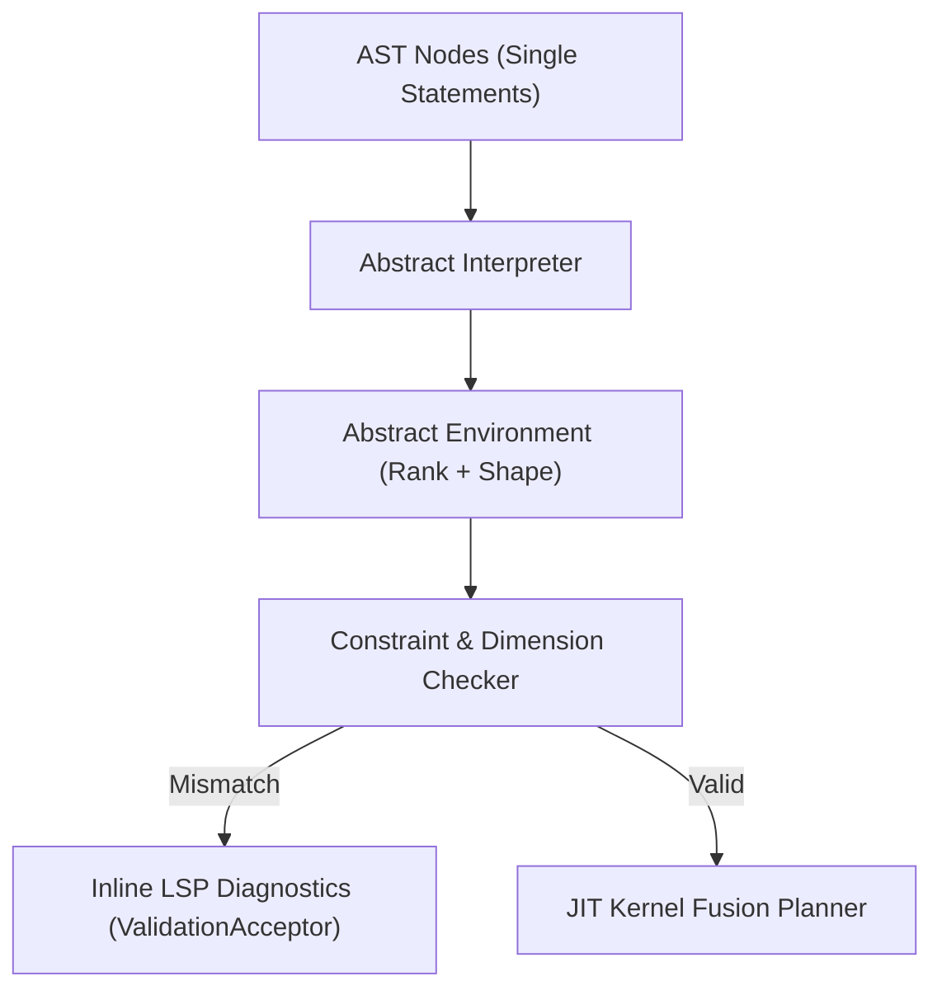

# 0002. Abstract Interpretation and Symbolic Shape Inference

* **Status:** Accepted
* **Date:** 2026-09-08
* **Deciders:** @kmmbvnr
* **Consulted:** Rank Language Specification, Abstract Interpretation Specification, Langium Validator Tests

## Context

In multi-dimensional array and tensor programming (APL, NumPy, JAX, PyTorch), the vast majority of developer errors stem from dimension mismatches:
- Reducing along an axis that does not exist (`* reduce rank 2` on a 1D vector);
- Aligning incompatible shapes during elementwise broadcasting;
- Applying whole-axis selectors (`# # #`) exceeding tensor rank;
- Passing matrices into functions expecting scalars.

In Rank, where code is authored without explicit type annotations and runs predominantly on mobile touchscreens and narrow 40-column terminals, discovering a dimension mismatch via a runtime panic during execution creates severe friction. Debugging runtime index crashes on a phone keyboard breaks flow.

Rank needs a non-executing static analysis pass that infers tensor types, ranks, and shapes at edit time, providing immediate inline LSP diagnostics without requiring explicit type annotations.

## Decision

Rank establishes **Static Abstract Interpretation and Symbolic Shape Inference**:

### 1. Structural Enablers in Rank
Static shape inference is notoriously intractable in Python/NumPy due to pointer aliasing, dynamic dispatch, and hidden mutations. Rank uniquely enables tractable, exact static analysis through four architectural invariants:
1. **Pure Value Semantics (ADR-0101):** Absence of mutable shared pointers means the dataflow is an acyclic dependency graph (DAG).
2. **Intentional Intermediate Variables (ADR-0300):** The 40-column budget encourages naming intermediate values (`Digits`, `Windows`, `Products`), naturally yielding a Static Single Assignment (SSA) graph.
3. **Literal Ranks and Axes (ADR-0200):** Modifiers (`rank 1`, `axis 0`, `#`) are almost exclusively syntactic literals rather than dynamic variables.
4. **Line-Level Error Localization:** Because each line performs exactly one transformation step, errors are pinpointed to the exact line and named operand without pipeline obscurity.

### 2. Separation of Rank and Shape
The abstract interpreter distinguishes **Rank** (number of dimensions) from **Shape** (concrete axis lengths):
- **Rank ($R \in \mathbb{N}_0$):** Fully decidable statically for virtually all operations:
  - Scalar: $R = 0$
  - Vector / Sequence: $R = 1$
  - Matrix / 2D Table: $R = 2$
  - $N$-D Tensor: $R = N$
- **Shape ($S = [d_1, \dots, d_R]$):** Represented as concrete numbers, affine symbols ($[N - K + 1, K]$), or bounded ranges ($[\le N]$).

Even when exact axis lengths are dynamic (e.g. after a boolean mask filter), the **Rank remains statically known**, allowing the validator to catch >70% of tensor misuse bugs before execution.

### 3. Real-Time LSP Diagnostic Emission
- The abstract interpretation pass is integrated directly into `RankValidator` via Langium.
- Incomplete or dimension-violating operations emit immediate, non-wrapping diagnostics to mobile editors and IDEs as code is typed.

## Consequences

### Positive
* **Catch errors before running:** Prevents runtime panics on mobile terminals by identifying shape mismatches during editing.
* **Zero annotation overhead:** Developers write clean, uncluttered BASIC-style code while enjoying the safety guarantees of a static type checker.
* **Foundation for JIT kernel fusion:** Statically inferred ranks and shapes feed directly into the tensor fusion planner, eliminating runtime guard checks.
* **Precise localization:** Pinpoints errors to the exact offending line and named variable.

### Negative / Trade-offs
* **Dynamic data boundaries:** Operations on external data with unknown shapes (such as dynamic CSV rows without headers) cannot be verified until runtime, falling back to dynamic guards.
