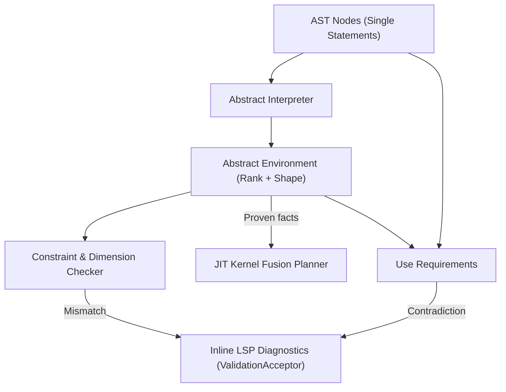

# 0002. Abstract Interpretation and Symbolic Shape Inference

* **Status:** Accepted
* **Date:** 2026-09-08
* **Updated:** 2026-10-02 — separate use requirements and proof limits
* **Deciders:** @kmmbvnr
* **Consulted:** Rank Language Specification, Abstract Interpretation Specification, Langium Validator Tests

## Context

In multi-dimensional array and tensor programming (APL, NumPy, JAX, PyTorch), the vast majority of developer errors stem from dimension mismatches:
- Reducing along an axis that does not exist (`reduce * rank 2` on a 1D vector);
- Aligning incompatible shapes during elementwise broadcasting;
- Applying whole-axis selectors (`# # #`) exceeding tensor rank;
- Passing matrices into functions expecting scalars.

In Rank, where code is authored without explicit type annotations and runs predominantly on mobile touchscreens and narrow 40-column terminals, discovering a dimension mismatch via a runtime panic during execution creates severe friction. Debugging runtime index crashes on a phone keyboard breaks flow.

Rank needs a non-executing static analysis pass that infers tensor types, ranks, and shapes at edit time, providing immediate inline LSP diagnostics without requiring explicit type annotations.

## Decision

Rank establishes **Static Abstract Interpretation and Symbolic Shape Inference**:

```mermaid
flowchart TD
    AST["AST Nodes (Single Statements)"] --> AbstractEval["Abstract Interpreter"]
    AbstractEval --> AbstractEnv["Abstract Environment (Rank + Shape)"]
    AbstractEnv --> Checker["Constraint & Dimension Checker"]
    Checker -->|Mismatch| Diagnostics["Inline LSP Diagnostics (ValidationAcceptor)"]
    AbstractEnv -->|Proven facts| KernelPlanner["JIT Kernel Fusion Planner"]
    AST --> Requirements["Use Requirements"]
    AbstractEnv --> Requirements
    Requirements -->|Contradiction| Diagnostics
```

### 1. Structural Enablers in Rank
Rank's analysis uses these language properties, while accounting for unknown
calls, shared references and mutation:

1. **Array Value Semantics (ADR-0101):** Copy-on-write arrays isolate ordinary array writes. Records and mutable collections still share identity through aliases.
2. **Intentional Intermediate Variables (ADR-0300):** Named intermediate values (`Digits`, `Windows`, `Products`) expose data flow; assignments and loops still require joins and effect analysis.
3. **Literal Ranks and Axes (ADR-0200):** Modifiers (`rank 1`, `axis 0`, `#`) are almost exclusively syntactic literals rather than dynamic variables.
4. **Line-Level Error Localization:** Because each line performs exactly one transformation step, errors are pinpointed to the exact line and named operand without pipeline obscurity.

### 2. Separation of Rank and Shape
The abstract interpreter distinguishes **Rank** (number of dimensions) from **Shape** (concrete axis lengths):
- **Rank ($R \in \mathbb{N}_0$):** Inferred where operands and operation contracts provide enough evidence:
  - Scalar: $R = 0$
  - Vector / Sequence: $R = 1$
  - Matrix: $R = 2$ (a table of object rows is rank 1)
  - $N$-D Tensor: $R = N$
- **Shape ($S = [d_1, \dots, d_R]$):** Value facts store known axis lengths or unknown lengths (`null`) in `shape`. A sidecar `dims` carries a symbolic length per axis where one is known, and `dim` carries the symbolic value of an integer scalar.

A symbolic dimension is a linear form `c + Σ kᵢ·xᵢ` over natural-number variables, kept canonical so equality is structural (`x+y+5+x` equals `(x+x)+5+y`). Variables are fresh per source: the length of an array whose size is unknown (`X len`), a bound length reused by `array shape N`, each `many` command-line value, and an array that is exactly one of several paths (a branch merge or a function result), which gets a variable of its own on each axis the paths disagree on. Collections never get one: their cells may differ in length. Function results carry the symbols of their arguments, so `normalize: [d] → [d]` is read off the body for each call. Comparison has three outcomes: equal (proven), distinct constants (a mismatch) and unknown. A symbol may be 1 under broadcasting, so two different symbols are never reported as a mismatch. Joins keep only dimensions proven equal, and loop or recursion widening drops them. Multiplication of symbols and inequality reasoning are out of scope.

Proven equal shapes are an analysis fact (`provenSameShape`). The tensor kernel planner does not consume them: its run-time shape comparison measured as a fraction of a percent of a small call, so removing it is not worth the risk of an unsound proof.

Rank can remain known when exact axis lengths are unknown. There is no measured
general percentage of tensor errors caught by this analysis.

### Contract inference and effects

Binding ranks, collection element contracts and recursive record field contracts
provide stable facts after successful writes. Record axis lengths remain unknown
because later same-rank assignments may change them. Safe direct collection
aliases retain element facts; unknown effects discard facts they could invalidate.

Reading standard input does not discard facts: it is a host token source with a type the program declares (`.integer`, `.word`), and a mismatch raises at the read. File reads and calls with unknown effects still do. A symbol also survives: `N = stdin .integer` has its own length variable, and `stdin .integer N array` (or the lazy `stdin .integer N`) has that length.

Function analysis specializes on argument types and ranks, known cell types and
record schemas. Recursive inference uses reachable base returns, then checks
recursive steps. Unknown callbacks and captured writes can prevent a proof;
an unresolved result is not itself a proven type error. See
[language ADR-0302](../language/0302-function-declarations-closures-and-tail-calls.md).

Type or rank knowledge alone does not prove bounds safety, eager evaluation or
absence of callbacks. Optimizations require those separate proofs. The runtime
enforces contracts where static analysis cannot establish them.

### Requirements inferred from uses (#69)

`inferRequirements(program)` collects a separate graph of necessary rank,
length and scalar/cell-domain requirements. `analyzeValues` exposes that graph
as `requirements` and adds its new contradictions to diagnostics. A contradiction
includes both source sites. Existing forward diagnostics take precedence when
they already explain an error at either site.

A requirement is not a proof. Requirement intervals and domains never enter
`ValueFacts`, callback-safety facts, fusion decisions, in-place updates, or guard
removal. The empty-frame evaluator also does not read them. Runtime behavior
continues to depend on runtime values and forward contracts alone. There are no
requirement-derived editor hints in this change.

Rank equalities use weighted union-find, with intervals for bounds. A worklist
propagates frame and sum relations. Exact dimension constraints reuse the `Dim`
symbols from the forward shape domain in a separate solver; solving a requirement
does not change those symbols' forward meaning. Cell domains intersect along
explicit value aliases. Array ranks follow binding contracts; lengths and cell
domains belong to values, since rebinding may change both. Missing seeds do not
establish a rank contract.

Function bodies produce templates even without calls. Calls instantiate fresh
variables so requirements from separate specializations cannot collide. Source
imports use the same templates through the existing module loader. Active
recursion is left unresolved. Template count, graph expansion and solver work
are bounded; the result exposes `limited` when a budget stops inference. These
budgets are independent of the forward call-analysis budget.

The collector follows current Rank semantics:

- `M # 1` requires two axes. The integer is a selector value, not an axis count.
- Ordinary `rank R` clamps positive ranks and accepts negative ranks. It does
  not imply `rank M >= R`. `reduce rank R` and explicit frame axes have their
  own requirements.
- An empty frame does not execute a cell. Cell-body constraints are connected
  only when execution is established; unknown or empty frames remain conservative.
- Arithmetic broadcasting permits size-1 stretching. It does not equate operand
  lengths. Exact dimension relations come from applicable builtin shape patterns.
- Operand acceptance is separate from callback-safety metadata. The initial
  `operandDomains` catalogue entries cover `sum` and `lower`; arithmetic domain
  constraints cover `/`, `//`, `%` and `**`. Overloaded acceptance must be checked
  before adding further entries.
- Conflicting cell domains do not prove an error for a possibly empty array.
  Diagnostics require scalar or nonempty-cell evidence.

Guarded branches, zero-trip loops, captured writes and unknown callbacks do not
supply unconditional requirements. Unsupported effects discard value links.
Text atoms and sequence boxing retain their existing forward rules. This pass
is intentionally incomplete; absence of a contradiction is not validation.

External data expectations remain requirements. Checked CSV/XML/JSON schemas
and read-time checks are separate work in #33 and #116. Neither arbitrary input
files nor test fixtures are read to manufacture static facts. Collection
infinity settlement is also outside this static-analysis change.

### 3. Real-Time LSP Diagnostic Emission
- The abstract interpretation pass is integrated directly into `RankValidator` via Langium.
- Incomplete or dimension-violating operations emit immediate, non-wrapping diagnostics to mobile editors and IDEs as code is typed.

## Consequences

### Positive
* **Catch errors before running:** Prevents runtime panics on mobile terminals by identifying shape mismatches during editing.
* **Zero annotation overhead:** Developers write clean, uncluttered BASIC-style code while enjoying the safety guarantees of a static type checker.
* **Optimization evidence:** Proven types, ranks and read-safety facts can support specialized execution. Unproved cases retain runtime guards or use the general path.
* **Precise localization:** Pinpoints errors to the exact offending line and named variable.

### Negative / Trade-offs
* **Dynamic data boundaries:** Operations on external data with unknown shapes (such as dynamic CSV rows without headers) cannot be verified until runtime, falling back to dynamic guards.
