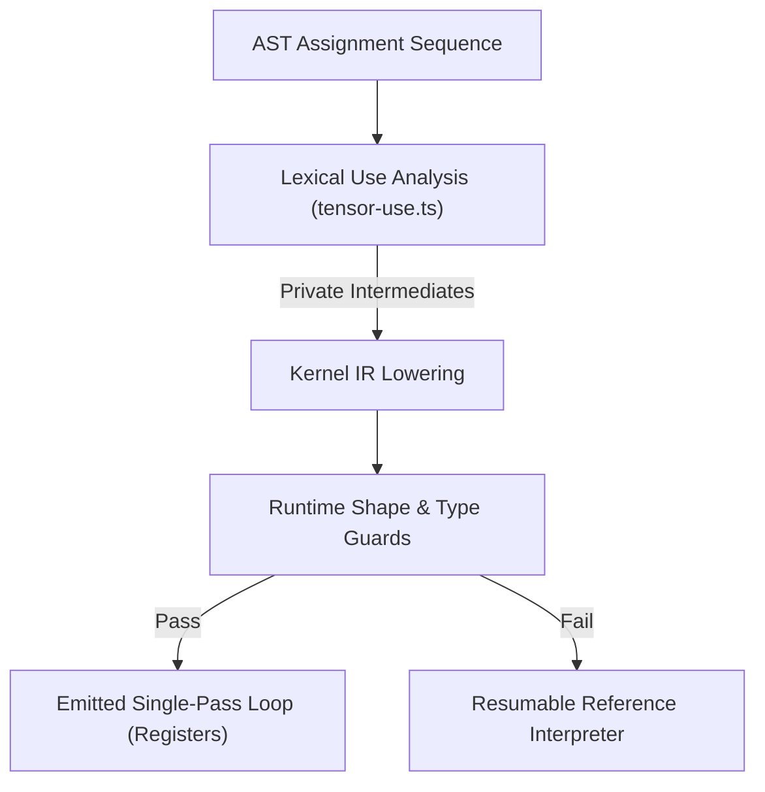

# 0003. Tensor Kernel Fusion and JIT Execution Planner

* **Status:** Accepted
* **Date:** 2026-09-11
* **Deciders:** @kmmbvnr
* **Consulted:** Rank Language Specification, Tensor Fusion Architecture, Tensor Benchmark Suite

## Context

Idiomatic Rank code emphasizes short lines (~40 columns, ADR-0000) and intentional intermediate variables (ADR-0300):
```rank
Squared = Error * Error
Mse = Squared mean
```

In traditional interpreted environments (like naive Python/NumPy):
1. **Memory bandwidth bottleneck:** Evaluating `Squared` allocates a full-sized intermediate heap array, writes all elements to RAM, and then reads them back into CPU caches during `mean`. For large arrays, memory bandwidth saturation—not arithmetic computation—dominates runtime.
2. **Pressure against clean code:** To avoid allocations in conventional languages, developers are forced to write massive, unreadable monolithic one-liners (`Mse = (Error * Error).mean()`) or manual C loops.
3. **Loss of REPL transparency:** Compilers that aggressively optimize whole programs often break step-by-step interactive debugging and REPL inspection.

Rank requires an execution architecture where naming intermediate values does not penalize performance, and compatible tensor operations are automatically fused into single-pass loops without intermediate heap allocations.

## Decision

Rank establishes **Tensor Kernel Fusion and the JIT Execution Planner** as the core execution architecture:



### 1. Fused Single-Pass Execution
- The interpreter analyzes groups of consecutive tensor assignment expressions.
- Operations including elementwise arithmetic (`+`, `-`, `*`, `/`, `**`), comparisons, boolean masks, vector gathers, and reductions (`sum`, `mean`, `min`, `max`, `all`, `any`, `count`) are combined into a **single fused execution kernel**.
- Intermediate values (`Squared`) are computed directly in CPU registers and fed immediately into subsequent operations without allocating intermediate arrays on the heap.

### 2. Lexical Barriers and Use Analysis (`tensor-use.ts`)
The planner preserves full linguistic transparency through static use analysis:
- **Private Intermediates:** A named variable is eliminated only if lexical use analysis proves it is private to the fused block, never read downstream, and not captured by a closure.
- **Escaping Intermediates:** If a variable is read later in the function or returned to the caller, the planner computes and stores its value without sacrificing fusion opportunities for other variables.

### 3. Strict Semantic Invariants
Tensor kernel fusion must be invisible to program semantics:
- **Exact Number Semantics:** Preserves arbitrary-precision BigInt integers and mixed-precision promotion rules.
- **Floating-Point Order:** Preserves IEEE-754 evaluation order; associativity is never assumed for floating-point operations.
- **Error Preservation:** Eager error checks (such as division by zero) are preserved; fusion never hides an observable runtime error.

### 4. Guarded Fallback to Reference Execution
- Every compiled kernel includes runtime shape and type guards.
- If shapes do not align, or if operands are lazy infinite sequences, execution cleanly falls back to the reference interpreter without re-executing side effects.
- Tensor fusion can be toggled globally via `InterpreterOptions.tensorFusion = false` for debugging.

## Consequences

### Positive
* **Zero penalty for clean code:** Programmers can freely name intermediate steps on narrow 40-column screens without paying any heap allocation or memory bandwidth penalties.
* **Cache-optimal performance:** Single-pass loops keep data resident in CPU L1/L2 caches and registers.
* **Transparent fallback:** Safe execution guarantees that unsupported operations never crash the compiler.
* **Foundation for hardware backends:** The Kernel IR serves as the direct compilation target for future WebGPU compute shaders and NPU accelerators.

### Negative / Trade-offs
* **JIT compilation overhead:** Compiling and caching fused loops introduces a slight setup latency; for very small arrays ($N < 10$), the reference interpreter may be faster.
