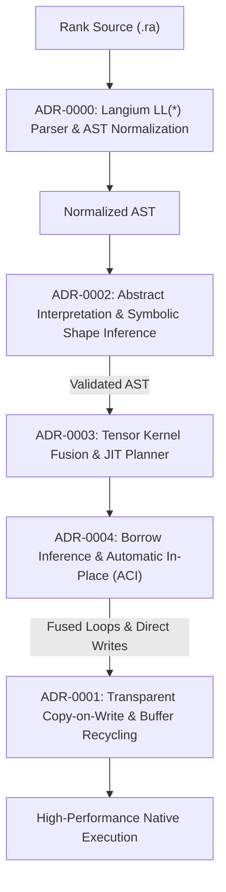

# Architecture Decision Records: Rank Implementation & Runtime

This directory documents the accepted architectural decisions governing the **Rank Compiler Implementation and Runtime Engine**: parser architecture, memory allocation, static abstract interpretation, and tensor kernel fusion.

---

## Table of Contents

- [The Implementation and Runtime Pipeline](#the-implementation-and-runtime-pipeline)
- [Architectural Index](#architectural-index) (ADR-0000 – ADR-0004)

---

## The Implementation and Runtime Pipeline

---

## Architectural Index

### Compiler Internals, Memory Model & Execution Engine

| ADR | Title | Summary |
|---|---|---|
| [ADR-0000](0000-langium-parser-architecture-and-grammar-decoupling.md) | Langium Parser Architecture and Grammar Decoupling | Stable Chevrotain LL(*) parser, whitespace juxtaposition resolution, error-tolerant CST, and LSP integration without runtime grammar mutation. |
| [ADR-0001](0001-transparent-cow-memory-model-and-buffer-recycling.md) | Transparent Copy-on-Write Memory Model, Buffer Recycling, and Cliff Prevention | Shared flat contiguous buffers, $O(1)$ in-place mutation for unique owners, Reset-to-Unbound loop cliff protection, and snapshot semantics. |
| [ADR-0002](0002-abstract-interpretation-and-symbolic-shape-inference.md) | Abstract Interpretation and Symbolic Shape Inference | Distinguishing Rank from Shape, static dimension verification at edit time, line-level error localization, and inline LSP diagnostics. |
| [ADR-0003](0003-tensor-kernel-fusion-and-execution-planner.md) | Tensor Kernel Fusion and JIT Execution Planner | Fusing consecutive assignment statements into single-pass register loops, eliminating temporary arrays, and lexical use analysis barriers. |
| [ADR-0004](0004-perceus-borrow-inference-and-compile-time-in-place.md) | Parameter Borrow Inference and Automatic Compile-Time In-Place (ACI) | Static borrow inference preventing false CoW on helper calls, compile-time elision of `refcount` guards in loops, and FBIP standard library algorithms. |
