# Architecture Decision Records: Rank Language Core

This directory documents the accepted architectural decisions governing the **Rank Language Core**: its foundational philosophy, lexical ergonomics, type system, memory model, tensor addressing engine, and execution flow.

The decisions are structured into four logical acts that build upon each other sequentially. Each act reserves a block of 100 numbers (`00xx`, `01xx`, `02xx`, `03xx`) to permit clean localized additions without cascading renumbering.

---

## Table of Contents

- [Act I: Philosophy, Ergonomics & Program Structure](#act-i-philosophy-ergonomics--program-structure) (ADR-0000 – ADR-0003)
- [Act II: Value Model & Type System](#act-ii-value-model--type-system) (ADR-0100 – ADR-0107)
- [Act III: Arrays, Tensors & Unified Selection Engine](#act-iii-arrays-tensors--unified-selection-engine) (ADR-0200 – ADR-0207)
- [Act IV: Computation, Control Flow & Dataflow](#act-iv-computation-control-flow--dataflow) (ADR-0300 – ADR-0308)

---

## The Four Acts of Rank Language Architecture

```mermaid
flowchart TD
    subgraph Act1 ["ACT I: Philosophy, Ergonomics & Program Structure (00xx)"]
        ADR0["0000: 40-Column Budget & Mobile-First"]
        ADR1["0001: Words Over Symbols"]
        ADR2["0002: Modern BASIC Lineage"]
        ADR3["0003: Modular Vocabulary & Grammar Independence ('use')"]
    end

    subgraph Act2 ["ACT II: Value Model & Type System (01xx)"]
        ADR100["0100: Inferred Type Stability & Invariance"]
        ADR101["0101: Value Semantics & Copy-on-Write"]
        ADR102["0102: Numeric Tower & Division"]
        ADR103["0103: Numeric Ranges ('to', 'until', 'by')"]
        ADR104["0104: Unicode Code Point Semantics & Text Blocks"]
        ADR105["0105: Symbol Scalars ('.name')"]
        ADR106["0106: Closed Typed Records"]
        ADR107["0107: Universal Fallback ('default')"]
    end

    subgraph Act3 ["ACT III: Arrays, Tensors & Unified Selection Engine (02xx)"]
        ADR200["0200: Rank Polymorphism & Leading-Frame Cells"]
        ADR201["0201: Array Construction & Matrix Blocks"]
        ADR202["0202: Whitespace Juxtaposition for Addressing"]
        ADR203["0203: First-Class Boolean Masks"]
        ADR204["0204: Whole-Axis Selector ('#')"]
        ADR205["0205: Contiguous Slicing ('from ... to/until')"]
        ADR206["0206: Index Array Selection & Permutation (Gather)"]
        ADR207["0207: Positional Unpacking & Splatting ('unpack')"]
    end

    subgraph Act4 ["ACT IV: Computation, Control Flow & Dataflow (03xx)"]
        ADR300["0300: Intentional Intermediate Variables"]
        ADR301["0301: Data-First Calling Convention"]
        ADR302["0302: Function Declarations, Closures & TCO ('fun')"]
        ADR303["0303: First-Class Automatic Memoization ('memo')"]
        ADR304["0304: Unified 'for' Loops & Pragmatic Flow"]
        ADR305["0305: Single-Pass Generator Sequences ('yield')"]
        ADR306["0306: Structured Error Handling & Symbol Kinds"]
        ADR307["0307: Statement-Based Conditionals ('if')"]
        ADR308["0308: Scope-Bound Resource Lifetimes"]
    end

    Act1 --> Act2
    Act2 --> Act3
    Act3 --> Act4
```

---

## Architectural Index

### Act I: Philosophy, Ergonomics & Program Structure
*How the language looks, why it is shaped for narrow mobile screens, and how programs are organized.*

| ADR | Title | Summary |
|---|---|---|
| [ADR-0000](0000-narrow-screen-and-mobile-first-ergonomics.md) | Narrow Screen Target and Mobile-First Ergonomics | The strict ~40-column line width constraint and mobile touchscreen ergonomics. |
| [ADR-0001](0001-words-over-symbols-for-comparisons.md) | Words Over Symbols for Comparisons and Logic | Primary keyboard layer words (`equal`, `at least`) instead of multi-layer punctuation. |
| [ADR-0002](0002-modern-basic-lineage-and-lexical-tone.md) | Modern BASIC Lineage and Lexical Tone | Approachable tone: `rem`, PascalCase variables, clean `end` blocks, no braces or semicolons. |
| [ADR-0003](0003-modular-vocabulary-and-grammar-independence.md) | Modular Vocabulary and Grammar Independence (`use`) | Self-contained parser grammar; `use` enables vocabulary and semantics after parsing. |

---

### Act II: Value Model & Type System
*What data exists in Rank, how variables bind values, and how data lives in memory.*

| ADR | Title | Summary |
|---|---|---|
| [ADR-0100](0100-inferred-type-stability-and-invariance.md) | Inferred Type Stability and Invariant Variable Binding | No declaration keywords (`let`/`var`); variables infer invariant types; runtime guards (`is`, `type`). |
| [ADR-0101](0101-value-semantics-and-copy-on-write.md) | Value Semantics with Copy-on-Write for Arrays and Tensors | Variables hold pure values; aliasing cannot mutate caller data; transparent Copy-on-Write. |
| [ADR-0102](0102-numeric-tower-and-division-semantics.md) | Numeric Tower and Division Semantics | Arbitrary-precision `integer` (BigInt), IEEE-754 `real`, `/` for real division, `//` for floor division. |
| [ADR-0103](0103-first-class-numeric-ranges.md) | First-Class Numeric Ranges (`to`, `until`, `by`) | Self-evident range sequences: `to` inclusive, `until` exclusive, strict step sign direction. |
| [ADR-0104](0104-unicode-code-point-semantics-for-text.md) | Unicode Code Point Semantics for Text Strings | Unicode scalar coordinates, surrogate safety, and 40-column multiline blocks (`text`, `text lines`). |
| [ADR-0105](0105-symbol-scalars-for-labels-and-enums.md) | Symbol Scalars for Labels, Enums, Fields, and Type Tags | Lightweight `.name` tokens for record fields, table columns, ad-hoc enums, and type guards. |
| [ADR-0106](0106-record-types.md) | Record Types as Closed, Typed Reference Structures | Typo-safe closed schemas with typed fields; explicit reference identity for autograd and graphs; `with` blocks for changed copies. |
| [ADR-0107](0107-universal-missing-value-fallback-default.md) | Universal Missing-Value Fallback via `default` Keyword | Unified absence handling across arrays, maps, and tables without `null` poisoning or `try/catch`. |

---

### Act III: Arrays, Tensors & Unified Selection Engine
*The computational core of Rank: how multi-dimensional data is constructed, addressed, sliced, and gathered.*

| ADR | Title | Summary |
|---|---|---|
| [ADR-0200](0200-rank-polymorphism-and-cell-framing.md) | Rank Polymorphism and Leading-Frame Cell Application | The eponymous paradigm: intrinsic ranks, `rank R` override, frame axes via `axis`, and `outer`. |
| [ADR-0201](0201-array-construction-and-matrix-blocks.md) | Array Construction and Multidimensional Block Syntax | Punctuation-free array literals: `array 1 2 3` and multiline visual 2D blocks `array shape ... end`. |
| [ADR-0202](0202-whitespace-juxtaposition-for-addressing.md) | Whitespace Juxtaposition for Addressing and Selection | Universal $\text{value} + \text{selector} \rightarrow \text{value}$ formula; non-negative indices. |
| [ADR-0203](0203-first-class-boolean-masks.md) | First-Class Boolean Masks for Selection and Assignment | Declarative filtering `A Mask` and conditional in-place updates `A Mask = 0`. |
| [ADR-0204](0204-whole-axis-tensor-selector-hash.md) | Whole-Axis Tensor Selector (`#`) | Extracting and mutating entire matrix columns (`M # j`) via long-press on `.`. |
| [ADR-0205](0205-contiguous-slicing-from-to-until.md) | Contiguous Slicing with `from ... to / until` | Boundary-safe contiguous slices across strings, 1D arrays, and tensor axes. |
| [ADR-0206](0206-index-array-selection-and-permutation.md) | Index Array Selection and Permutation (Gather Addressing) | Arbitrary permutation, duplication along axis 0, and multidimensional Cartesian sub-blocks. |
| [ADR-0207](0207-positional-unpacking-and-splatting.md) | Positional Unpacking and Argument Splatting (`unpack`) | Destructuring LHS, argument splatting RHS, and coordinate expansion `A unpack Coors`. |

---

### Act IV: Computation, Control Flow & Dataflow
*How algorithms are structured, invoked, and iterated.*

| ADR | Title | Summary |
|---|---|---|
| [ADR-0300](0300-intentional-intermediate-variables.md) | Intentional Intermediate Variables Over Vertical Pipelines | Self-documenting, REPL-inspectable step-by-step assignments over horizontal pipe chains. |
| [ADR-0301](0301-data-first-calling-convention.md) | Data-First Calling Convention and Arity Resolution | Postfix call flow (`A B gcd`), zero-parenthesis invocation, left-associative arity absorption, and no infix `min`/`max`. |
| [ADR-0302](0302-function-declarations-closures-and-tail-calls.md) | Function Declarations, Closures, and Tail-Call Optimization (`fun`) | Zero-parenthesis function definitions, declaration hoisting, lexical closures, and guaranteed TCO frame replacement. |
| [ADR-0303](0303-first-class-automatic-memoization.md) | First-Class Automatic Memoization (`memo`) | First-class `memo` keyword turning pure recursive functions into dynamic programming state caches. |
| [ADR-0304](0304-unify-loops-under-for.md) | Unification of All Loops Under `for` | Single iteration statement replacing `while`/`loop`, explicit nested blocks, and single-level `break`/`continue`. |
| [ADR-0305](0305-generator-functions-and-single-pass-streams.md) | Generator Functions and Single-Pass Streams (`yield`) | Lazy stateful producers via `yield`, single-pass consumption contract (`.ConsumedSequence`), and deterministic cleanup. |
| [ADR-0306](0306-structured-error-handling-and-symbol-kinds.md) | Structured Error Handling and Symbol Kinds (`try` / `catch` / `raise`) | Postfix error signaling via `raise`, symbol kinds (`.InvalidInput`), and leak-safe `try/catch/finally` blocks. |
| [ADR-0307](0307-statement-based-conditionals-and-branch-scoping.md) | Statement-Based Conditionals and Branch Scoping (`if`, `elif`, `else`) | Vertically aligned conditional blocks without inline ternary operators, flat workspace scoping, and union widening. |
| [ADR-0308](0308-scope-bound-deterministic-resource-lifetimes.md) | Scope-Bound Deterministic Resource Lifetimes | Deterministic resource destruction on scope exit with move-on-return, eliminating `with` indentation and `defer`. |
