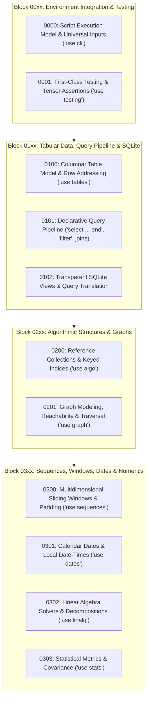

# Architecture Decision Records: Rank Standard Library & Extensions

This directory documents the accepted architectural decisions governing the **Rank Standard Library & Domain Extensions** loaded via `use`: execution models, CLI inputs, testing syntax, columnar tables, SQL integration, algorithmic data structures, graphs, multidimensional windows, calendar dates, and numerical solvers.

Decisions in this domain are organized into modular blocks of 100 numbers (`00xx`, `01xx`, `02xx`, `03xx`) to allow localized expansion without renumbering.

---

## Table of Contents

- [Block 00xx: Environment Integration & Testing](#block-00xx-environment-integration--testing) (ADR-0000 – ADR-0001)
- [Block 01xx: Tabular Data, Query Pipeline & SQLite](#block-01xx-tabular-data-query-pipeline--sqlite) (ADR-0100 – ADR-0102)
- [Block 02xx: Algorithmic Structures & Graphs](#block-02xx-algorithmic-structures--graphs) (ADR-0200 – ADR-0201)
- [Block 03xx: Sequences, Windows, Dates & Numerics](#block-03xx-sequences-windows-dates--numerics) (ADR-0300 – ADR-0303)

---

## Architecture of Standard Library Extensions

---

## Architectural Index

### Block 00xx: Environment Integration & Testing
*How Rank programs receive inputs, execute across environments, and assert whole-tensor invariants.*

| ADR | Title | Summary |
|---|---|---|
| [ADR-0000](0000-script-execution-model-and-universal-input-contracts.md) | Script Execution Model and Universal Input Contracts (`use cli`) | Zero-ceremony sequential execution without `main()`, input contracts (`option`, `argument`, `flag`), and strict precedence (`workspace -> args -> default`). |
| [ADR-0001](0001-first-class-testing-and-whole-tensor-assertions.md) | First-Class Testing Syntax and Whole-Tensor Assertions (`use testing`) | Isolated workspace test blocks (`test "..." ... end`), bare relational assertions, and single-expression whole-tensor verification. |

---

### Block 01xx: Tabular Data, Query Pipeline & SQLite
*How columnar tables are structured, queried, joined, and translated into optimized SQL.*

| ADR | Title | Summary |
|---|---|---|
| [ADR-0100](0100-columnar-table-model-and-record-row-addressing.md) | Columnar Table Model and Record-Row Addressing (`use tables`) | Tables as collections of row objects, lazy symbol projections (`Data .Age`), absence fallback via `default`, and revision tracking. |
| [ADR-0101](0101-declarative-table-query-pipeline-select-filter-joins.md) | Declarative Table Query Pipeline (`select`, `filter`, joins) | Query shaping blocks (`select ... end`), concise row filters, declarative joins (`innerjoin by`, `leftjoin on`), and group aggregations. |
| [ADR-0102](0102-transparent-sqlite-views-and-sql-query-translation.md) | Transparent SQLite Views and Query Translation (`use tables`) | Deferred query plans over SQLite files, SQL aggregate pushdown, injection-proof parameters, and `sql`/`explain` inspection. |

---

### Block 02xx: Algorithmic Structures & Graphs
*Reference data structures with identity, keyed indexes, and graph algorithms.*

| ADR | Title | Summary |
|---|---|---|
| [ADR-0200](0200-reference-collections-and-keyed-indices.md) | Reference Collections and Keyed Indices (`use algo`) | Stateful reference collections (`queue`, `heap`, `index`, `multiset`), implicit local instances, and logarithmic range trees (`fenwick`, `segment`). |
| [ADR-0201](0201-graph-modeling-reachability-and-traversal.md) | Graph Modeling, Reachability, and Traversal (`use graph`) | Directed/undirected graph construction, neighbor traversal via addressing, built-in DSU, and functional graph binary lifting. |

---

### Block 03xx: Sequences, Windows, Dates & Numerics
*Multidimensional sliding windows, calendar date math, linear algebra solvers, and statistical metrics.*

| ADR | Title | Summary |
|---|---|---|
| [ADR-0300](0300-multidimensional-sliding-windows-and-padding.md) | Multidimensional Sliding Windows, Stride, and Padding (`use sequences`) | Zero-copy lazy tensor windowing (`window`), strided convolution, symmetric zero padding, and rank-combinator fusion. |
| [ADR-0301](0301-calendar-dates-and-local-datetimes.md) | Calendar Dates and Local Date-Times (`use dates`) | Dedicated `date` and `datetime` scalar types, ISO parsing, symbol field access (`.year`), and daylight-safe duration math. |
| [ADR-0302](0302-linear-algebra-solvers-and-decompositions.md) | Linear Algebra Solvers and Matrix Decompositions (`use linalg`) | Data-first `matmul`, intrinsic rank-2 direct solvers (`solve`), matrix inversion, determinants, and symmetric `eigh`. |
| [ADR-0303](0303-statistical-error-metrics-and-covariance.md) | Statistical Error Metrics and Covariance (`use stats`) | Dispersion metrics (`mean`, `std`), dedicated loss metrics (`mse`, `mae`), and multivariate sample `covariance` matrices. |
